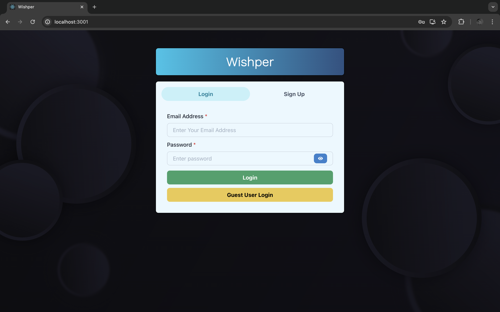
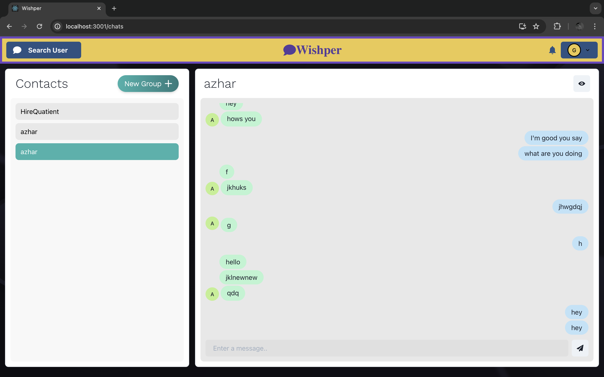
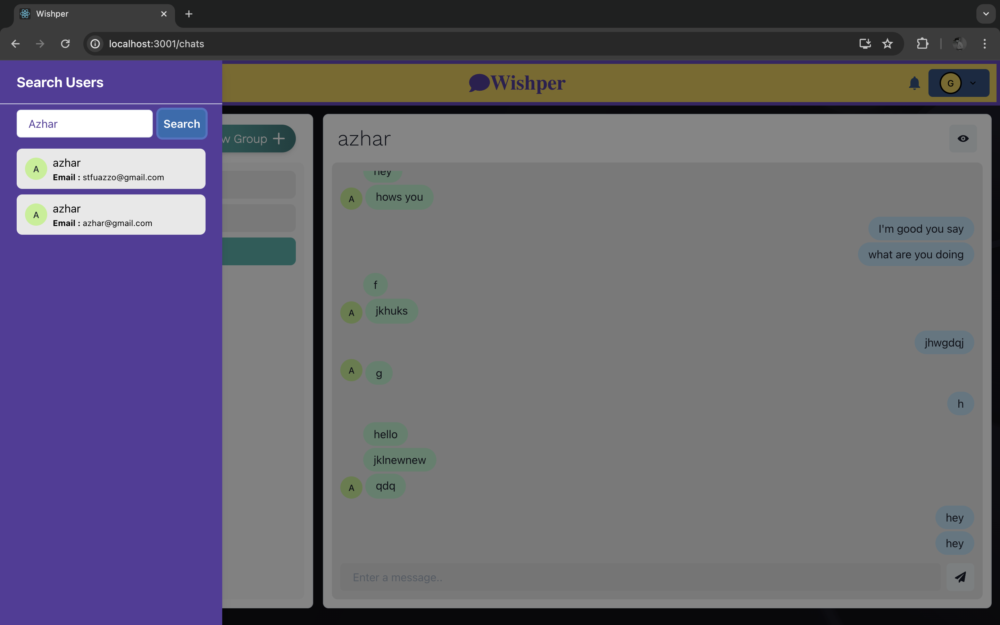
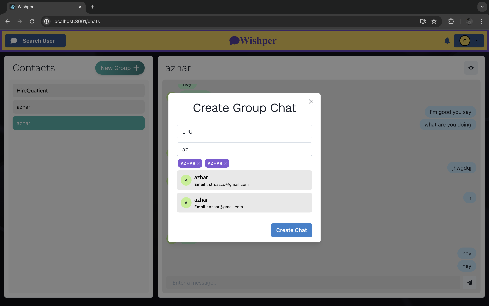

# Wishper - MERN Chat Application

Wishper is a full-stack chat application built using the MERN (MongoDB, Express.js, React.js, Node.js) stack. It allows users to authenticate, create groups, search for users, and engage in real-time messaging.

## Screenshots

### Authentication Page (scr1.png)

### Homepage (scr2.png)

### Search User Page (scr3.png)

### Create Group Page (scr4.png)

## Features

- User Authentication: Sign up, log in, log out.
- Real-time Messaging: Instant messaging functionality.
- Group Creation: Users can create groups and invite others to join.
- User Search: Search functionality to find other users.

## Technologies Used

- MongoDB: NoSQL database for data storage.
- Express.js: Backend framework for Node.js.
- React.js: Frontend JavaScript library.
- Node.js: JavaScript runtime environment.
- Socket.io: Real-time bi-directional communication between clients and servers.
- Redux: State management library for React.

## Installation

To run this project locally, follow these steps:

1. Clone this repository.
2. Navigate to the project directory.
3. Install dependencies using `npm install` or `yarn install`.
4. Set up environment variables for MongoDB connection and JWT secret.
5. Run the backend server using `npm start` or `yarn start`.
6. Navigate to the `client` directory.
7. Install client dependencies using `npm install` or `yarn install`.
8. Run the React development server using `npm start` or `yarn start`.
9. Access the application in your browser at `http://localhost:3000`.

## Contributing

Contributions are welcome! Please open an issue or submit a pull request.

## License

This project is licensed under the [MIT License](LICENSE).

## Creator

Created by [@bunnysayzz](https://github.com/bunnysayzz).

## Portfolio

Visit my portfolio at [imazhar.live](https://imazhar.live).

